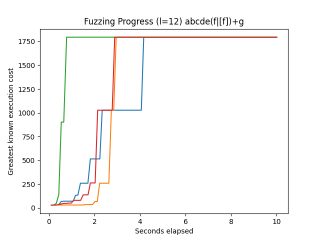

# Regulator

Regulator is a fuzzer for detecting performance bugs in regular expressions.

We currently only support fuzzing the V8 regexp engine [irregexp](https://blog.chromium.org/2009/02/irregexp-google-chromes-new-regexp.html), as implemented in nodejs. The irregexp engine is also found in chromium and [firefox](https://hacks.mozilla.org/2020/06/a-new-regexp-engine-in-spidermonkey/).

## Building

To build locally:

1. Get dependencies:\
`apt-get update &&
apt-get install -y git build-essential python3 python3-distutils`

2. Run `make`

## Testing

We use the test framework [catch2](https://github.com/catchorg/Catch2), all test files can be found under `test/`. To run the tests, first ensure that the project builds as described above, then use `make test`.

The tests compile to a binary at `build/tests`. Use this either for debugging or for manually passing command-line flags to catch2 for changing the test suite configuration.

## Running

The built fuzzer lives at `build/fuzzer`. Use `./build/fuzzer --help` for a full listing of options.

### Example

`./build/fuzzer --timeout=360 -r 'http://(b|[b])*c' -l 17 -w 1 --debug`

Explanation: Run the fuzzer for 360 seconds against the regexp `http://(b|[b])*c`, with a subject length of 17 characters, a character width of 1 byte, and debug output on.

## Useful Scripts

The script `time_plot_fuzz.py` is useful to generate graphs of fuzzing progress.

To run, first install Python 3, numpy and matplotlib. Use `python3 time_plot_fuzz.py --help` for a full listing of options.

### Example for `time_plot_fuzz.py`

`python3 time_plot_fuzz.py -l 12 -b 1 -t 10 --runs 4 'abcde(f|[f])+g'`

Explanation: Fuzz the regexp `abcde(f|[f])+g` using a 12 character subject string and 1-byte width chars for 10 seconds; this repeats 4 times and the results over time are overlaid on the output image.

Here are the results for that example:

